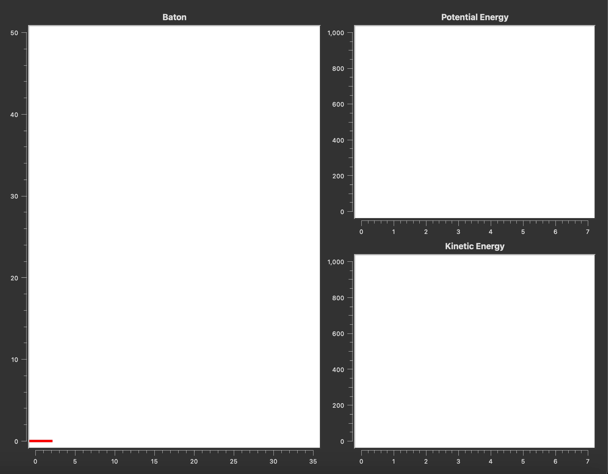

## Baton Trajectory
This program plots the trajectory of a spinning baton. The controllable parameters are its starting velocity, starting angle and starting angular velocity. This is an exercise in a textbook by Landau (2015)[^1].

[^1]: Landau, R. H. (2015). Computational physics problem solving with python. John Wiley & Sons, Incorporated. 

## Program example
